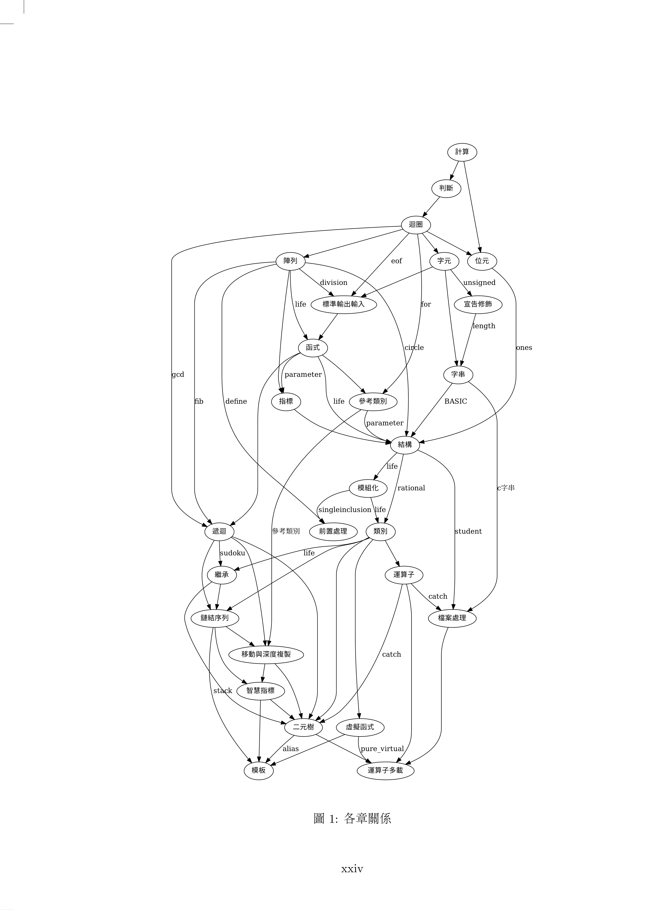

# Cplusplus refactor

這些是本人的"由重構學習 C++ 程式設計"書中的範例。
這本書的寫法是以重構 (refactor) 為中心，也就是以一再改寫來引導初學者。
這本書分為兩個部份，第一個部分到第七章為止講述 C++ 基本觀念，為重構做準備。
第二個部分是這本書的主要核心，藉由重構逐一介紹 C++ 的進階觀念。  
在我教程式語言的經驗中，學生往往知道一個機制，但是卻不會實際運用，這在 C++ 這種複雜的程式語言尤其明顯。 
我覺得原因在於教學的時候往往著重機制的規則，而不瞭解機制的原理及應用。 
那麼要如何改進？
這本書是以重構為中心。
程式本來是這樣寫，今天我增加了一個機制，我就可以這樣寫，而這樣寫有什麼好處？
我希望用不斷的重構，讓學生能瞭解機制的應用，才能將機制應用在自己的程式。
就好像修改文章一樣，一修再修，越修越好，而且要知道為什麼這樣修比較好。
請注意本書以重構為順序，並不拘泥一般的章節分類。
只要重構需要，有的觀念會提早出現。
例如 #define 雖然是前置處理，但是只要重構需要，就會提早介紹。
本書各章的關係請見下圖。

